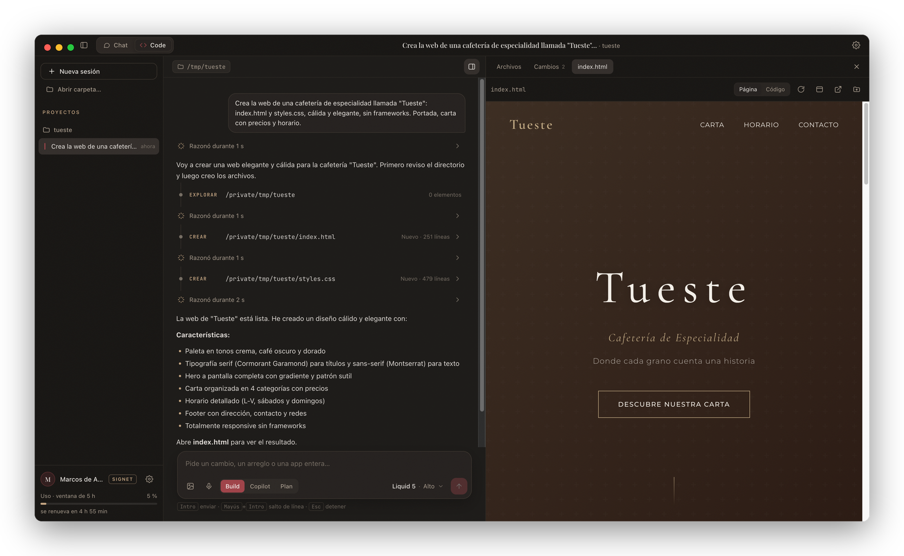
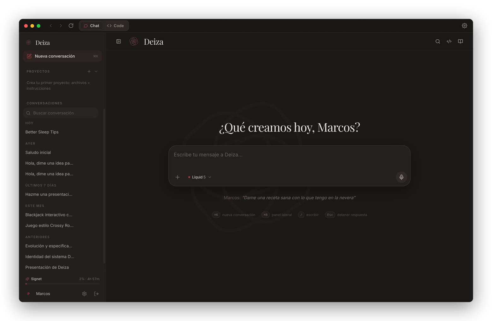
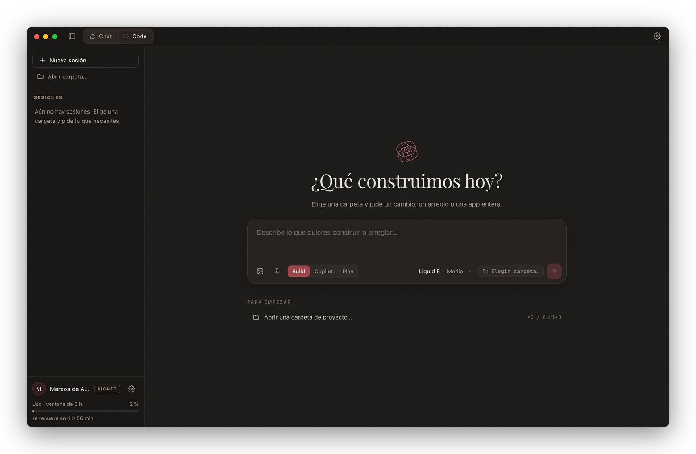
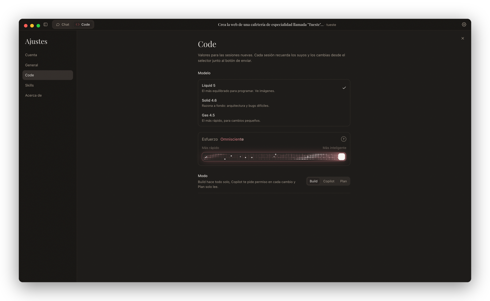
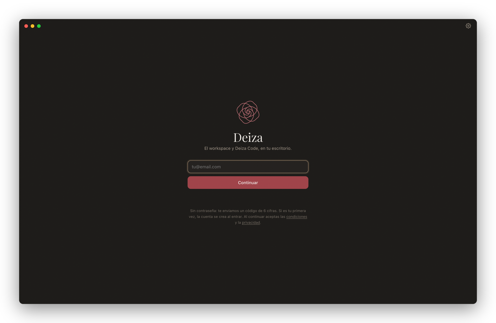
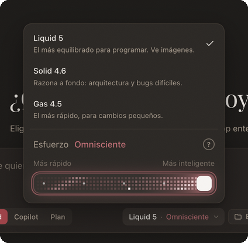
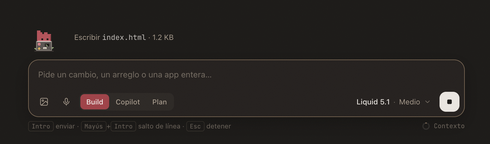
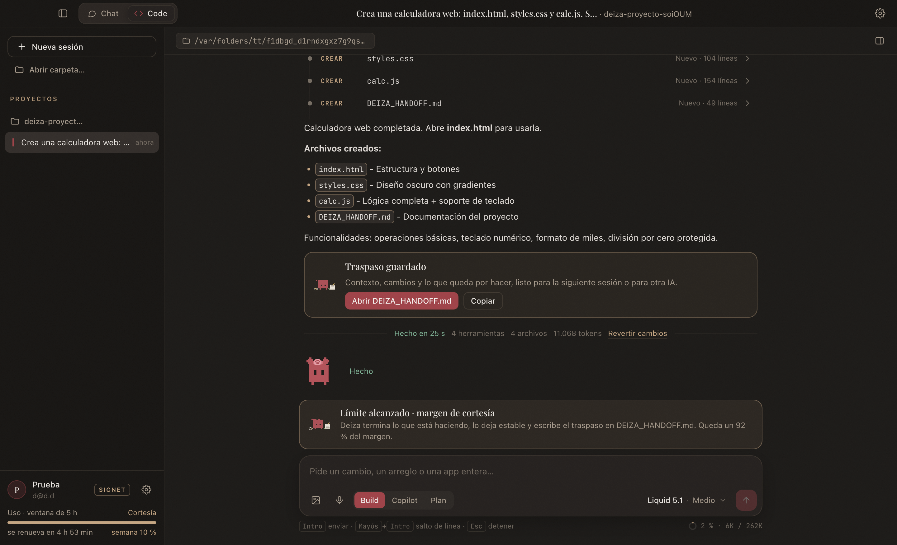

# Deiza para escritorio

El workspace de Deiza y Deiza Code en una sola app para macOS, Windows y Linux.

**Chat** es el workspace completo de Deiza, con todo lo que hace la web: artefactos, documentos, presentaciones, búsqueda, proyectos, voz. **Code** es un agente de programación que trabaja directamente en las carpetas de tu equipo, con una interfaz nativa: diffs, terminal en vivo, aprobaciones y vista previa.

[Descargar](https://deiza.org/desktop) · [Deiza](https://deiza.org) · [Deiza Code (CLI)](https://github.com/marcosdeaza/deiza-code) · [Deiza Core](https://github.com/marcosdeaza/deiza-core)



## Capturas

| | |
|---|---|
|  |  |
| **Chat.** El workspace de deiza.org, con la sesión de la app. | **Code.** Elige una carpeta y pide un cambio, un arreglo o una app entera. |
|  |  |
| **Ajustes.** Cuenta, idioma, atajos, valores de Code y skills. | **Inicio de sesión.** Sin contraseña: un código de 6 cifras por email. |

<p align="center"></p>

## Capu

<p align="center"></p>

Capu es la mascota de Deiza Code: un capullo de rosa hecho bloque, con el pétalo izquierdo más alto y dos ojos que son huecos. Vive junto a la línea de estado mientras el agente trabaja y cambia de escena según lo que pasa: teclea en un portátil lleno de pegatinas cuando escribe, mira arriba cuando piensa, lee con lupa, espera con la barra de progreso mientras corre un comando, le cuenta el bug al pato de goma cuando algo falla tres veces y florece cuando la tarea termina. De vez en cuando se toma un café o se echa una lata por el hueco de los pétalos. Si se acaba el uso, se mustia y se pone a escribir el traspaso. Se apaga en Ajustes, Code.



El motor de animación es un solo archivo sin dependencias (`src/renderer/capu.js`): la silueta base de 8×10 para logos y terminal y las escenas a doble resolución, con los props dibujados a píxel fino. Ficha del personaje: [docs/capu/capu-sheet.png](docs/capu/capu-sheet.png).

## Qué hace

**Chat**
- El workspace completo de deiza.org en una vista aislada, siempre al día.
- Inicio de sesión nativo antes de nada; la web arranca ya con tu sesión.
- Descargas con progreso, notificaciones del sistema, menú contextual y atajo global para abrir Deiza desde cualquier app.

**Code**
- Agente local que lee, escribe y ejecuta en la carpeta del proyecto, con tres modos: **Build** (autónomo), **Copilot** (apruebas cada cambio y comando) y **Plan** (solo lee y propone).
- Tarjetas por herramienta: diffs con líneas añadidas y quitadas, salida de terminal en directo, "Revertir cambios" por respuesta.
- Panel lateral con el árbol del proyecto, los cambios de la sesión y vista previa de archivos y páginas HTML.
- Modelo (Liquid 5.1, Solid 5, Gas 4.5) y esfuerzo en cinco niveles, de Bajo a Omnisciente, con el razonamiento del modelo visible y plegable.
- Dictado por voz y tus skills de Deiza aplicadas también al agente.
- Arrastra archivos, scripts, imágenes, carpetas y ZIP al mensaje. Se adjuntan sin cambiar el proyecto; los ZIP se extraen para que el agente pueda leerlos.
- Navegador propio con dirección, pestañas, sesión persistente, lectura de páginas, capturas, clics, texto, teclas y desplazamiento. Sirve para probar las apps que crea Code y trabajar con las webs en las que inicias sesión.
- Control del equipo: lista de aplicaciones, capturas de una ventana o pantalla, foco, clics, texto, teclas y desplazamiento. En macOS necesita los permisos de Grabación de pantalla y Accesibilidad; en Linux la entrada usa `xdotool` en X11 y no está disponible en Wayland. Las capturas y las acciones visuales requieren Solid o Liquid.
- La conversación se ajusta sola a la ventana de contexto real de cada modelo, y el contexto ocupado se ve siempre junto al compositor.
- Margen de cortesía: si el uso se acaba a mitad de una tarea, el agente la cierra, deja el trabajo estable y escribe `DEIZA_HANDOFF.md` con el contexto, los cambios y lo pendiente (si no llega, la app lo genera). La barra de uso avisa al 85 % y enseña la semana.



**App**
- Actualizaciones de un clic: descarga, comprueba la huella sha256 e instala al reiniciar.
- Ajustes propios, interfaz en español e inglés y el idioma del chat sincronizado con la web.

En el navegador, inicia sesión tú mismo y pide a Code una tarea concreta: leer varios correos, consultar una página de Teams o probar un formulario de tu app. Las páginas se tratan como contenido, y el agente pide aprobación para las acciones de Copilot. Plan permite consultar, pero no clicar, escribir ni guardar capturas. Las tareas se ejecutan durante la conversación; no hay vigilancia en segundo plano.

La terminal [Deiza Code](https://github.com/marcosdeaza/deiza-code) comparte estas herramientas mientras Deiza está abierta. Usa `/attach ruta` para adjuntar archivos y `/computer` para comprobar la conexión.

## Instalar

Descarga el instalador en [deiza.org/desktop](https://deiza.org/desktop) o usa el comando de una línea, que evita los avisos de seguridad del navegador:

```bash
# macOS
curl -fsSL https://deiza.org/downloads/desktop/install.sh | bash
```

```powershell
# Windows (PowerShell)
irm https://deiza.org/downloads/desktop/install.ps1 | iex
```

Los dos comprueban que el archivo descargado es idéntico al publicado antes de instalar. Las versiones siguientes se instalan desde la propia app.

## Compilar

Requisitos: Node.js 22 y npm. Python 3 con Pillow solo hace falta para regenerar iconos.

```bash
npm install
npm start                # modo desarrollo
```

| Plataforma | Comando | Resultado en `release/` |
|---|---|---|
| macOS | `npm run dist:mac -- --arm64 --x64` | `.dmg` y `.zip` para Apple Silicon e Intel |
| Windows | `npm run dist:win` | instalador `.exe` (NSIS, por usuario) |
| Linux | `npm run dist:linux` | `.AppImage` y `.deb` (x64 y arm64) |
| Microsoft Store | `npm run dist:store` (en Windows) | paquete `.appx` firmado luego por Microsoft |

Los instaladores de Windows y Linux también se pueden generar desde macOS. El flujo de GitHub Actions (`.github/workflows/build.yml`) compila las tres plataformas en sus propios sistemas en cada cambio y deja los instaladores como artefactos.

### Firma

Sin credenciales, las compilaciones van con firma ad hoc: macOS y Windows avisan la primera vez que se instala algo descargado desde el navegador (nunca en las actualizaciones). Para firmar:

- **macOS**: define `APPLE_TEAM_ID` más `APPLE_API_KEY`, `APPLE_API_KEY_ID` y `APPLE_API_ISSUER` (o `APPLE_ID` y `APPLE_APP_SPECIFIC_PASSWORD`) y ten el certificado "Developer ID Application" en el llavero. `npm run release` firma y notariza.
- **Windows**: `WIN_CSC_LINK` y `WIN_CSC_KEY_PASSWORD` con tu certificado `.pfx`.

### Publicar una versión

`npm run release -- "Notas de la versión"` compila todo, escribe `release/latest.json` con tamaños y sha256, sube los instaladores a tu servidor y comprueba las huellas allí. Necesita `DEIZA_SSH` (host del servidor) y `DEIZA_RELEASE_DIR` (carpeta que se sirve como `/downloads/desktop/`), en el entorno o en un archivo `.release.env` que no se sube al repositorio. Las apps instaladas leen `latest.json` y muestran el botón de actualizar.

## Configuración

| Variable | Para qué |
|---|---|
| `DEIZA_URL` | Servidor de Deiza al que se conecta la app (por defecto `https://deiza.org`). Sirve para usarla con tu propia instancia de [Deiza Core](https://github.com/marcosdeaza/deiza-core). |
| `DEIZA_USER_DATA` | Carpeta de perfil alternativa, para pruebas o varias cuentas. |
| `DEIZA_TEST_TOKEN` | Solo en desarrollo: arranca con una sesión ya iniciada. |

## Cómo está hecha

- **Electron 44.** Una ventana con barra propia y el conmutador Chat / Code.
- `src/main`: proceso principal (ventana, sesión, ajustes, actualizaciones y host de Code).
- `src/preload`: puentes mínimos y tipados hacia la interfaz local y hacia la web.
- `src/renderer`: interfaz local (barra, Code, ajustes), sin frameworks.
- `src/engine`: el agente de Code, que corre en un proceso aparte por sesión con la carpeta del proyecto como directorio de trabajo. Reutiliza los módulos de [Deiza Code](https://github.com/marcosdeaza/deiza-code) (`npm run sync-engine`).
- `src/shared`: el reductor de la conversación, compartido por el proceso principal y la interfaz, y los textos en español e inglés.
- **Seguridad.** La web va en una vista aislada con `sandbox` y `contextIsolation`, sin acceso a Node. Los fusibles de Electron desactivan `runAsNode` y la inspección, y comprueban la integridad del `asar`. La sesión se guarda cifrada.

## Licencia

[MIT](LICENSE) © Marcos de Aza
